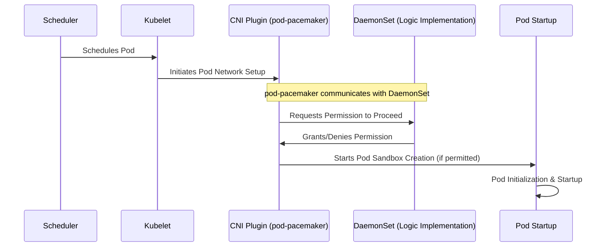

# PodPacemaker

PodPacemaker is a Kubernetes tool designed to manage the rate at which pods are initiated on a specific node, providing a controlled environment for pod deployment. Unlike traditional methods that modify the application itself or utilize initContainers, pod-pacemaker offers a seamless integration without altering the pod's inherent configuration. This mechanism is particularly useful for ensuring system stability and efficiency by preventing resource saturation caused by the simultaneous startup of numerous pods. It effectively addresses the "thundering herd" problem, commonly encountered with Java or PHP processes, by managing the concurrency of pod startups.

## How It Works

PodPacemaker operates as a CNI (Container Network Interface) plugin, embedding itself into the pod lifecycle at a critical early stage. By functioning at the CNI level, pod-pacemaker is able to intervene immediately after the scheduler's decision but before the pod's network setup is finalized. It strategically delays the creation of the pod sandbox, effectively spacing out pod initializations, mitigating potential stress on the node's resources.

## Key Features

- **Seamless Integration:** Functions as a CNI plugin, requiring no modifications to the pod spec or reliance on initContainers.
- **Controlled Pod Startup:** Manages the concurrency of pod startups, enhancing node stability and performance.
- **Unobtrusive Design:** Operates without altering the Kubernetes scheduler's behavior, ensuring compatibility and simplicity.

## Limitations

- **New Pod Creation Only:** It is designed to control the initiation of new pods. It does not apply to pods that are restarting due to crashes or OOM kills. As such, it is focused on initial deployment scenarios rather than recovery or error-handling situations.

## Configuration

The `PacemakerConfig` Custom Resource Definition (CRD) provides a flexible way to define throttling configurations. Within the `throttleConfig` section of a `PacemakerConfig` resource, you can specify detailed settings that influence how throttling is applied. This flexibility allows for fine-tuned control over resource consumption, ensuring critical applications have the necessary resources while preventing any single workload from monopolizing cluster resources.

### PacemakerConfig Resource

`nodeSelector`: A map of key-value pairs used for selecting the nodes where the throttling configuration will apply. This allows targeting specific nodes based on labels.
`priority`: An integer value that defines the priority of the configuration. Higher values indicate higher priority, allowing certain configurations to take precedence over others.

### Throttling Configuration Options

The `throttleConfig` section comprises four key types of throttling parameters, each targeting different aspects of system performance:

1. **CPU Throttling (`cpu`)**:

   - `maxLoad`: Specifies the maximum CPU load allowed. This setting helps in preventing CPU overutilization by triggering throttling when the workload reaches the specified load, ensuring that CPU resources are fairly distributed among all running applications.

2. **I/O Throttling (`io`)**:

   - `maxLoad`: Defines the maximum I/O load that is permissible. Similar to CPU throttling, this parameter aims to avoid overutilization of I/O resources, ensuring stable and predictable performance across different workloads, especially in environments with heavy read/write operations.

3. **Concurrency Throttling (`maxConcurrent`)**:

   - `perCore`: The maximum number of concurrent processes allowed per CPU core. This setting is crucial for optimizing the distribution of computational tasks, especially in multi-core environments, to prevent any single core from becoming a bottleneck.
   - `value`: An overall cap on the number of concurrent processes across the entire system, providing an additional layer of control over the workload distribution and concurrency management.

4. **Rate Limiting (`rateLimit`)**:
   - `burst`: The maximum number of requests that can be handled in a burst, allowing for short spikes in traffic or workload without triggering throttling. This parameter is particularly useful for services that experience variable load.
   - `fillFactor`: Controls the rate at which the allowance for burst traffic is replenished. A higher fill factor allows for more frequent bursts of traffic, whereas a lower fill factor imposes stricter control, gradually replenishing the capacity for handling bursts.

### Summary

By configuring these four types of throttling parameters within the `PacemakerConfig` resource, administrators can finely tune how resources are allocated and consumed, ensuring that critical services receive the resources they need while maintaining overall system stability and performance. This level of control is essential for managing workloads in dynamic, distributed environments like Kubernetes.

## License

pod-pacemaker is released under the MIT License.
