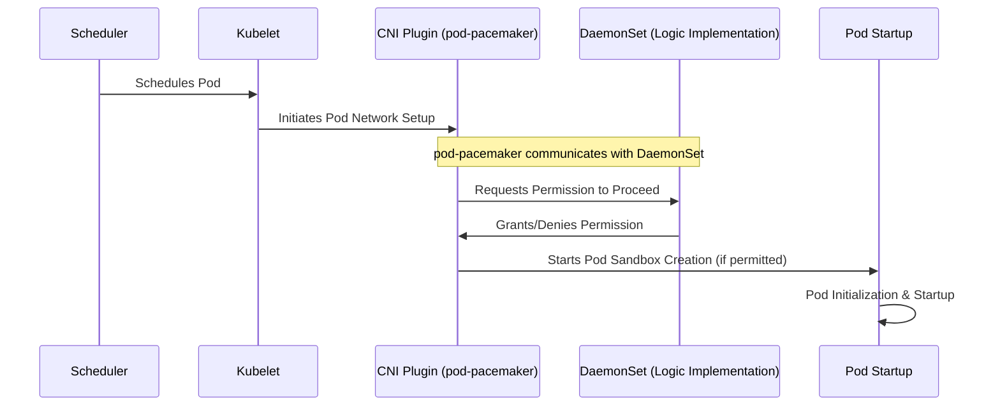

# pod-pacemaker

pod-pacemaker is a Kubernetes tool designed to manage the rate at which pods are initiated on a specific node, providing a controlled environment for pod deployment. Unlike traditional methods that modify the application itself or utilize initContainers, pod-pacemaker offers a seamless integration without altering the pod's inherent configuration. This mechanism is particularly useful for ensuring system stability and efficiency by preventing resource saturation caused by the simultaneous startup of numerous pods. It effectively addresses the "thundering herd" problem, commonly encountered with Java or PHP processes, by managing the concurrency of pod startups.

## How It Works

pod-pacemaker operates as a CNI (Container Network Interface) plugin, embedding itself into the pod lifecycle at a critical early stage. By functioning at the CNI level, pod-pacemaker is able to intervene immediately after the scheduler's decision but before the pod's network setup is finalized. It strategically delays the creation of the pod sandbox, effectively spacing out pod initializations, mitigating potential stress on the node's resources.

## Key Features

- **Seamless Integration:** Functions as a CNI plugin, requiring no modifications to the pod spec or reliance on initContainers.
- **Controlled Pod Startup:** Manages the concurrency of pod startups, enhancing node stability and performance.
- **Unobtrusive Design:** Operates without altering the Kubernetes scheduler's behavior, ensuring compatibility and simplicity.

## Limitations

- **New Pod Creation Only:** It is designed to control the initiation of new pods. It does not apply to pods that are restarting due to crashes or OOM kills. As such, it is focused on initial deployment scenarios rather than recovery or error-handling situations.

## License

pod-pacemaker is released under the MIT License.
