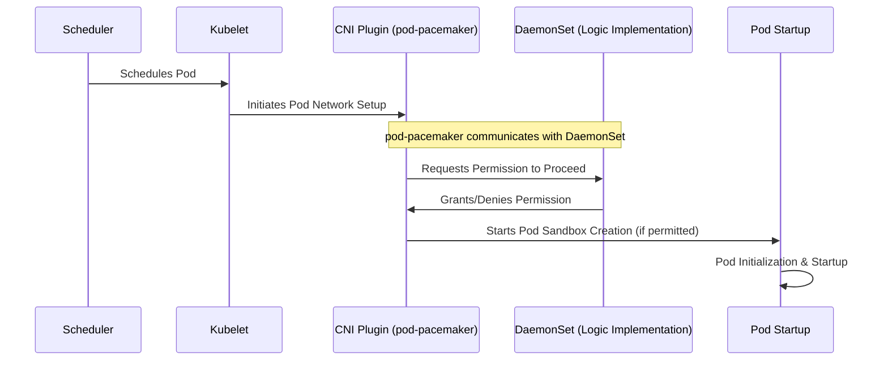

# PodPacemaker

PodPacemaker is a Kubernetes operator designed to manage the rate at which pods are initiated on a specific node, providing a controlled environment for pod deployment. Unlike traditional methods that modify the application itself or utilize initContainers, PodPacemaker offers a seamless integration without altering the pod's inherent configuration. This mechanism is particularly useful for ensuring system stability and efficiency by preventing resource saturation caused by the simultaneous startup of numerous pods. It effectively addresses the "thundering herd" problem, commonly encountered with Java or PHP processes, by managing the concurrency of pod startups.

## How It Works

PodPacemaker operates as a CNI (Container Network Interface) plugin, embedding itself into the pod lifecycle at a critical early stage. By functioning at the CNI level, PodPacemaker is able to intervene immediately after the scheduler's decision but before the pod's network setup is finalized. It strategically delays the creation of the pod sandbox, effectively spacing out pod initializations, mitigating potential stress on the node's resources.



## Key Features

- **Reuse of startup/readiness probes:** The concurrency mechanism makes use of the pod's startup and readiness probes to determine when the pod is started successfully.
- **Seamless Integration:** Functions as a CNI plugin, requiring no modifications to the pod spec or reliance on initContainers.
- **Controlled Pod Startup:** Manages the concurrency of pod startups, enhancing node stability and performance.
- **Unobtrusive Design:** Operates without altering the Kubernetes scheduler's behavior, ensuring compatibility and simplicity.

## Limitations

- **New Pod Creation Only:** It is designed to control the initiation of new pods. It does not apply to pods that are restarting due to crashes or OOM kills. As such, it is focused on initial deployment scenarios rather than recovery or error-handling situations.

## Installation

### Helm Chart

The easiest way to install PodPacemaker is by using the provided Helm chart. The chart includes all the necessary components to deploy PodPacemaker on your Kubernetes cluster.

```bash
helm install pod-pacemaker oci://ghcr.io/woehrl01/pod-pacemaker/pod-pacemaker --version 1.2.0
```

> [!NOTE]
> If you want to uninstall PodPacemaker, you have to manually delete the `/etc/cni/net.d/00-merged-pod-pacemaker.conflist` file from all nodes you have installed PodPacemaker on. This is necessary to remove the CNI plugin from the system, which cannot be done automatically by Helm.
> Alternatively, you change the helm value `cni.disableThrottle` to `true` before uninstalling the Helm chart. This will effectively make the CNI plugin a no-op and prevent it from interfering with the pod startup process.

## Configuration

The `PacemakerConfig` Custom Resource Definition (CRD) provides a flexible way to define throttling configurations. Within the `throttleConfig` section of a `PacemakerConfig` resource, you can specify detailed settings that influence how throttling is applied. This flexibility allows for fine-tuned control over resource consumption, ensuring critical applications have the necessary resources while preventing any single workload from monopolizing cluster resources.

### PacemakerConfig Resource

`nodeSelector`: A map of key-value pairs used for selecting the nodes where the throttling configuration will apply. This allows targeting specific nodes based on labels.

`priority`: An integer value that defines the priority of the configuration. Higher values indicate higher priority, allowing certain configurations to take precedence over others.

### Throttling Configuration Options

The `throttleConfig` section comprises four key types of throttling parameters, each targeting different aspects of system performance. If you configure multiple algorithms in the same configuration, they are applied in the following order: `rateLimit`, `maxConcurrent`, `cpu`, and `io`.

1. **Rate Limiting (`rateLimit`)**:

   - `burst`: The maximum number of pods that can be started in a burst. This parameter helps in controlling the rate of pod initialization, preventing sudden spikes in resource consumption that could lead to performance degradation.
   - `fillFactor`: Controls the rate at which the allowed burst is refilled. e.g. `1s` means one pod per second.

2. **Concurrency Throttling (`maxConcurrent`)**:

   - `perCore`: The maximum number of concurrent pod starts allowed per CPU core. e.g. `0.5` means 0.5 pods per core.
   - `value`: An overall cap on the number of concurrent pods starting simultaneously. This is a fixed limit. For a more dynamic approach, consider using `perCore` instead.

3. **CPU Throttling (`cpu`)**:

   - `maxLoad`: Specifies the maximum CPU load allowed. This setting aims to prevent overutilization of CPU resources, ensuring that the system remains responsive and stable when starting new pods. e.g. `0.8` means 80% of CPU usage.
   - `incrementBy`: Defines the amount by which the current CPU usage is increased for each pod. This parameter is useful when the actual CPU usage is not known and you want to increase the current usage by a fixed value until the actual usage is calculated. e.g. `0.1` means 10% of CPU usage.

4. **I/O Throttling (`io`)**:

   - `maxLoad`: Defines the maximum I/O load that is permissible. Similar to CPU throttling, this setting helps prevent I/O saturation, ensuring that the system remains responsive and stable during pod initialization. e.g. `0.5` means 50% of I/O usage.
   - `incrementBy`: Defines the amount by which the current I/O usage is increased for each pod. This parameter is useful when the actual I/O usage is not known and you want to increase the current usage by a fixed value until the actual usage is calculated. e.g. `0.1` means 10% of I/O usage.

> [!NOTE]
> If using the `cpu` or `io` throttling options, consider it in combination with the other throttling options, as the current resource usage will be only calculated as an average of the last 5 seconds.
> Alternatively, you can use the `incrementBy` parameter to increase the current resource usage for each pod by a fixed value until the actual usage is calculated.

### Exclude Pods

#### Annotation

You can exclude specific pods from the throttling mechanism by adding the `pod-pacemaker/skip: "true"` annotation to the pod's metadata. This annotation instructs PodPacemaker to bypass the throttling mechanism for the specified pod, allowing it to start without any restrictions.

```yaml
apiVersion: v1
kind: Pod
metadata:
  name: my-pod
  annotations:
    pod-pacemaker/skip: "true"
```

#### DaemonSet

You can also exclude pods if they are part of a DaemonSet. By adding configuring `--skip-daemonsets=true` in the `node-daemon` container arguments, PodPacemaker will skip DaemonSet pods. This is enabled by default.

#### Namespace

You can exclude pods from a specific namespace by specifying the namespaces in the `--namespace-exclusions` flag in the `init-cni` container arguments. By default, the `kube-system` namespace is excluded.

### Summary

By configuring these four types of throttling parameters within the `PacemakerConfig` resource, administrators can finely tune how resources are allocated and consumed, ensuring that critical services receive the resources they need while maintaining overall system stability and performance.

## License

PodPacemaker is released under the MIT License.
